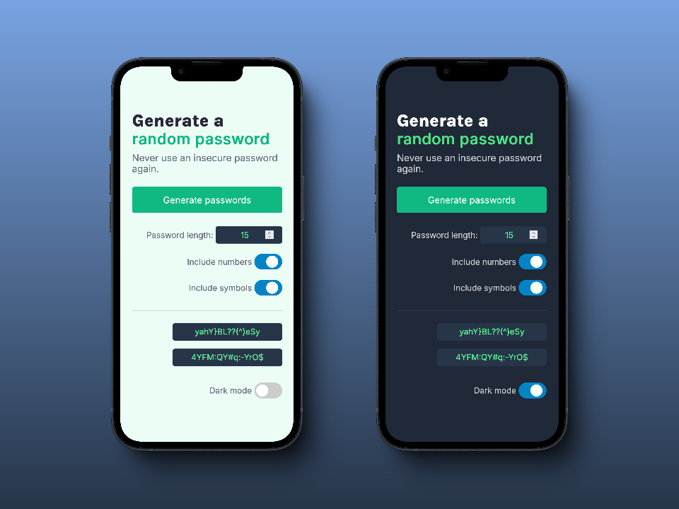
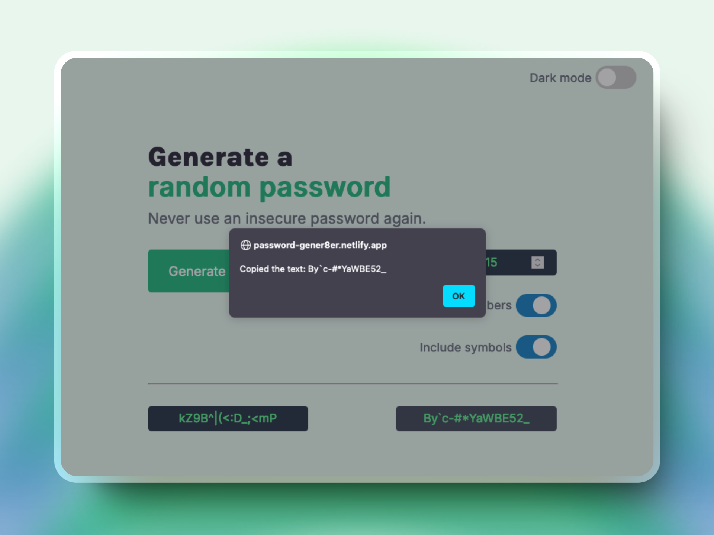

# Password Generator - Solo Project

## *Overview* 🧐
This project is part of the **"Making websites interactive"** module from the [**Frontend Career Path**](https://v2.scrimba.com/the-frontend-developer-career-path-c0j) course on [**Scrimba**](https://v2.scrimba.com/home).

The Password Generator offers the same essential functions as: **1Password**, **Apple Keychain**, or **bitwarden**: The ability to create random passwords, of any length (up to 128 characters), to include/exclude special symbols or numbers, and "click-to-copy" for any password you create.

## *Requirements* 📝

✅ ~~Build it from scratch.~~

✅ ~~Generate two random passwords when the user clicks the button.~~

✅ ~~Each password should be 15 characters long.~~

## *Stretch goals* 💪

✅ ~~Ability to set password length.~~

✅ ~~Add "copy-to-click".~~

✅ ~~Toggle "symbols" and "numbers" on/off.~~

## *Going above and beyond* 🚀

✅ ~~Error handling.~~

✅ ~~Responsive design.~~

✅ ~~Progressive Web APP functionality.~~

✅ ~~Dark mode toggle.~~

## *Screenshots* 📷

## *Links* 🔗

[Scrim code](https://v1.scrimba.com/scrim/cPvy9rTK) 👈

[Live site](https://password-gener8er.netlify.app) 👈

## *What I learned* 🤓

🔳 **Dark Mode:** While reasearching various methods to implement dark mode, I learned about `CSS Variables` and `classList.toggle` as a way to keep the code modular and maintainable.

🔳 **Window load event:** I used the `window.onload` method to ensure the toggle states are set only after the DOM is fully loaded.

🔳 **Input sanitization & Error handling** I created a function to ensure the password length was 'valid' and notified the user when it was not.

🔳 **Helper functions:** Rather than creating event listeners for each HTML element, I used a series of helper functions to increase readability and modularity. 

🔳 **UI Optimizations:** I added a smooth animation for the transition to light mode, and selectively applied the `pointer` style to the password boxes only after the passwords were created.

## *Resources* 🗃️

🗃️ [Frontend Career Path](https://v2.scrimba.com/the-frontend-developer-career-path-c0j) by Scrimba
