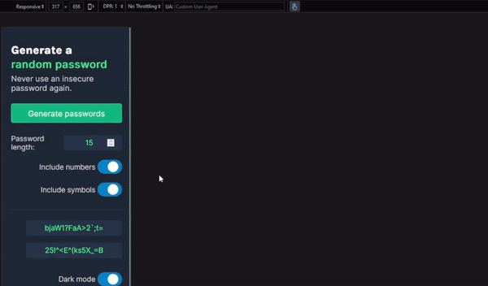

# Password Generator - Solo Project

## *Overview* 🧐
This project is part of the **"Making websites interactive"** module from the [**Frontend Career Path**](https://v2.scrimba.com/the-frontend-developer-career-path-c0j) course on [**Scrimba**](https://v2.scrimba.com/home).

The Password Generator offers the same essential functions as: **1Password**, **Apple Keychain**, or **bitwarden**: The ability to create random passwords, of any length (up to 128 characters), to include/exclude special symbols or numbers, and "click-to-copy" for any password you create.

## *Requirements* 📝

✅ ~~Build it from scratch.~~

✅ ~~Generate two random passwords when the user clicks the button.~~

✅ ~~Each password should be 15 characters long.~~

## *Stretch goals* 💪

✅ ~~Ability to set password length.~~

✅ ~~Add "copy-to-click".~~

✅ ~~Toggle "symbols" and "numbers" on/off.~~

## *Going above and beyond* 🚀

✅ ~~Error handling.~~

✅ ~~Responsive design.~~

✅ ~~Progressive Web APP functionality.~~

✅ ~~Dark mode toggle.~~

## *Screenshots* 📷

## *Links* 🔗

[Scrim code](https://v2.scrimba.com/s0cviu1jfb) 👈

[Live site](https://mendezpvi.github.io/fcp-oldagram/) 👈

## *What I learned* 🤓

🔳 **Importing constants from JS files:** I used `import` to manage icons and data from separate files, keeping the code modular and maintainable.

🔳 **Defer in JavaScript:** I used the `defer` attribute to ensure the script runs after the DOM is fully loaded.

🔳 **Focus-visible:** I implemented accessible styles to improve the visibility of focused elements, but only for keyboard users.

🔳 **Outline and accessibility:** I applied the outline attribute to maintain accessibility without compromising aesthetics, improving the experience for keyboard-dependent users.

🔳 **CSS transitions:** I added smooth transitions for hover and focus effects on the icons for a better user experience.

## *Resources* 🗃️

🗃️ [Frontend Career Path](https://v2.scrimba.com/the-frontend-developer-career-path-c0j) by Scrimba

## *Author* 🔰

✨ Frontend Mentor - [@medezpvi](https://www.frontendmentor.io/profile/mendezpvi)

✨ X (formerly Twitter) - [@medezpvi](https://x.com/mendezpvi)
